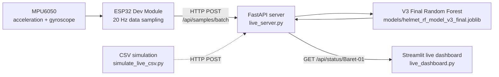
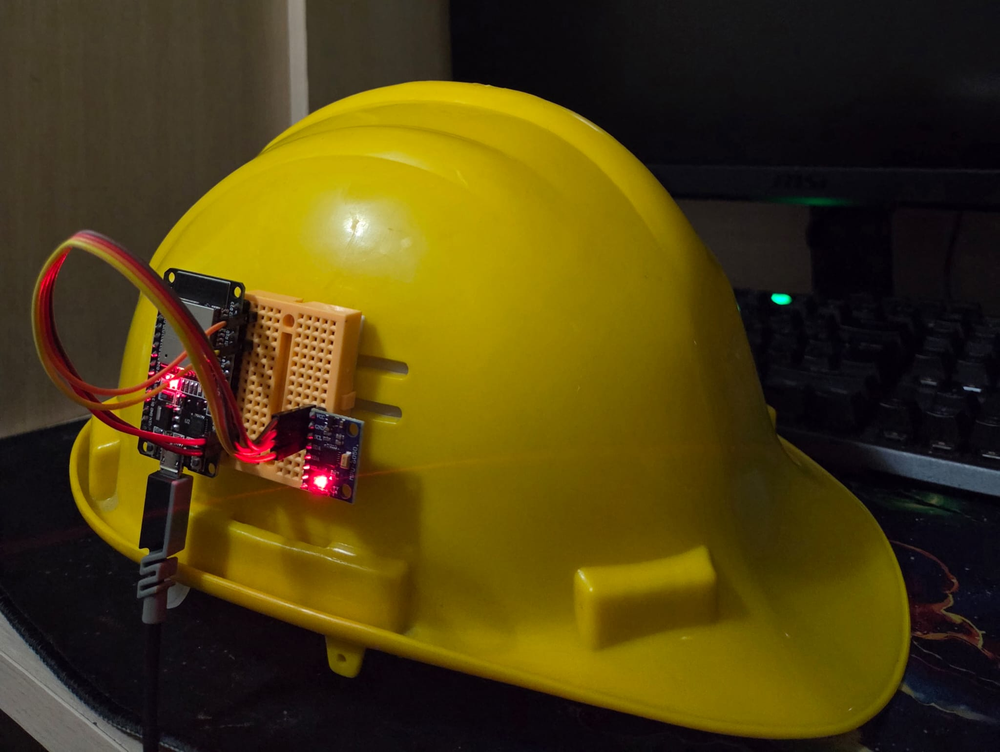
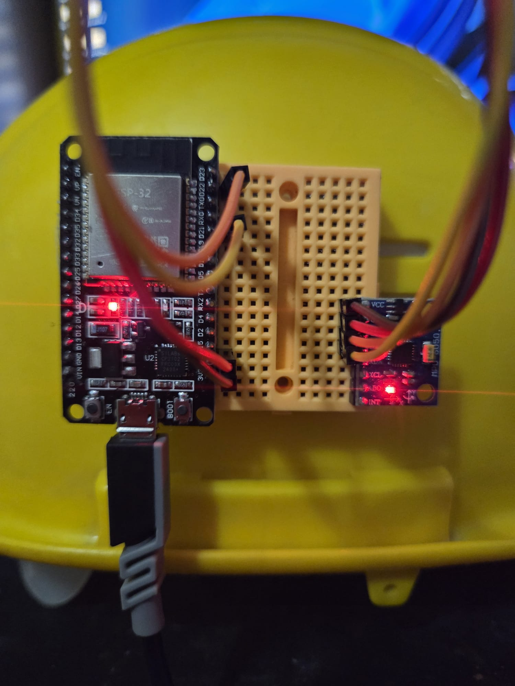
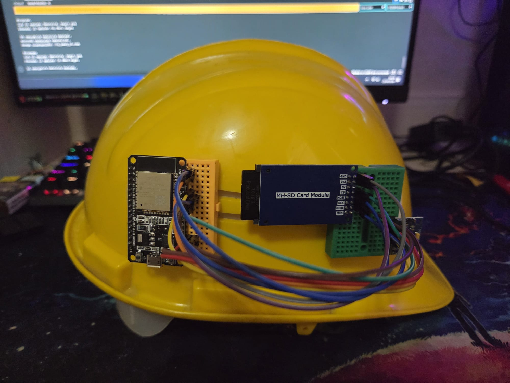
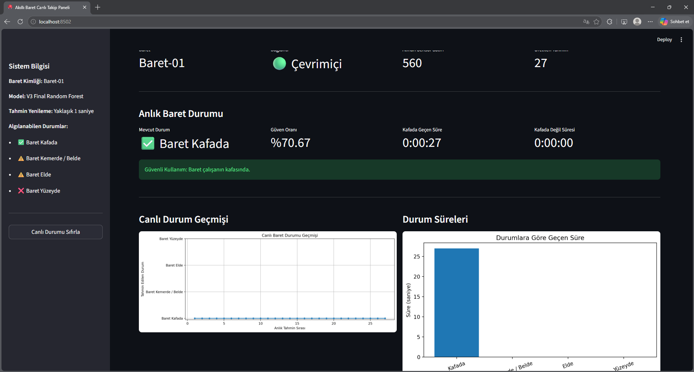
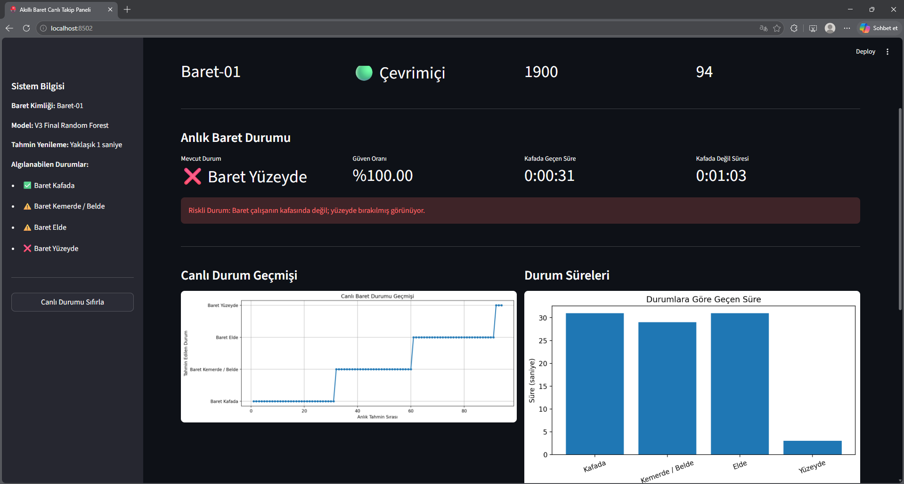
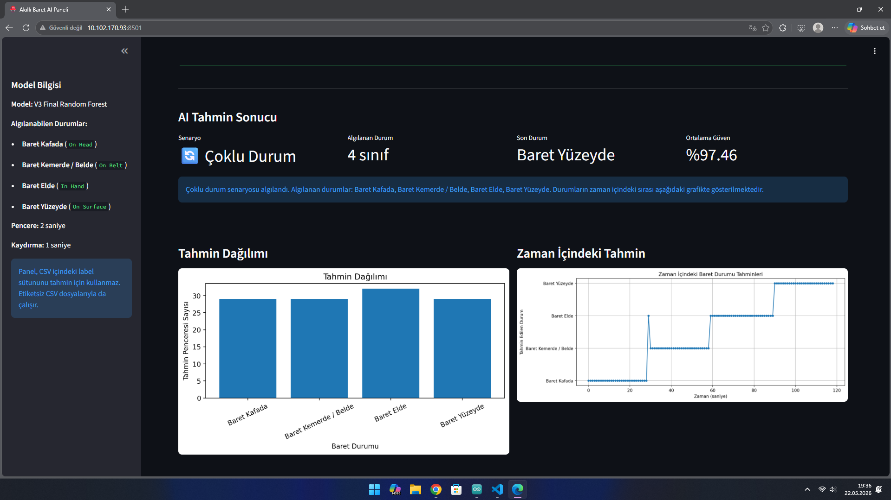
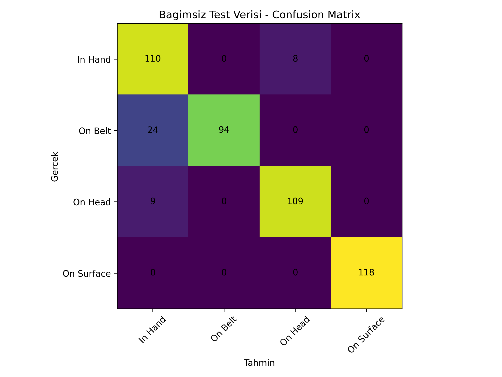
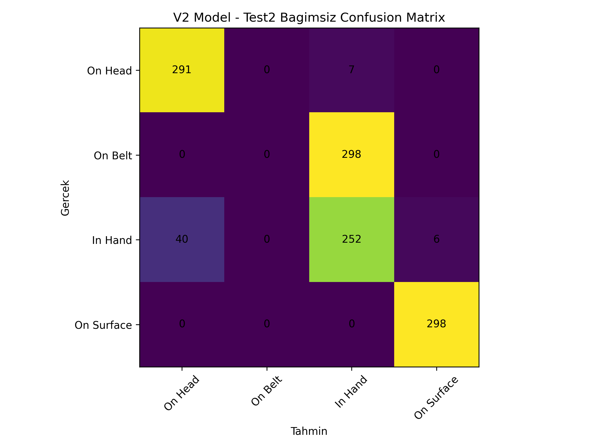
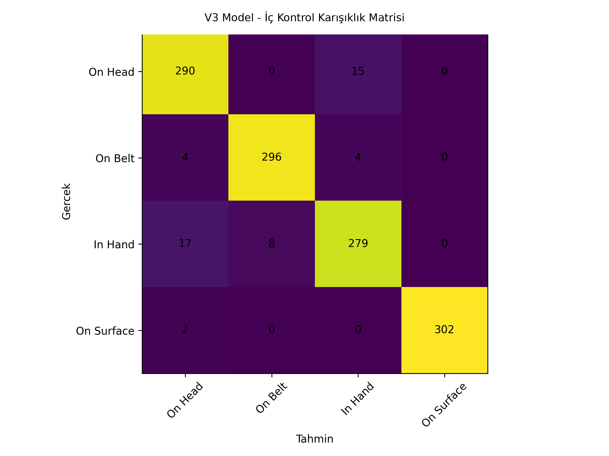

[🇹🇷 Türkçe](README.md) | [🇬🇧 English](README_EN.md)

---

# Smart Helmet Live Monitoring System

Smart Helmet is a prototype for monitoring the real-time usage state of a safety helmet in construction and occupational safety contexts without using a camera. The system sends MPU6050 accelerometer and gyroscope data from an ESP32 to a FastAPI server over Wi-Fi; the V3 Final Random Forest model generates predictions, and the Streamlit live dashboard allows a supervisor to monitor the current state.

The main product is the live monitoring flow; `app.py` is kept as an offline/CSV-based demo dashboard.

## Problem and Solution

Monitoring whether a helmet is actually worn on the head with a camera can create privacy, cost, and environmental-condition challenges in the field. This prototype classifies four states using motion and orientation data collected from an IMU sensor mounted on the helmet:

| Model class | Meaning |
| --- | --- |
| `On Head` | Helmet Worn on Head |
| `On Belt` | Helmet Carried on Belt / Waist |
| `In Hand` | Helmet Carried in Hand |
| `On Surface` | Helmet Placed on a Surface |

## Key Features

- IMU-based state detection without using a camera
- Live Wi-Fi data streaming with ESP32
- FastAPI-based AI prediction server
- Streamlit live monitoring dashboard
- 2-second prediction window with approximately 1-second updates
- Live stream simulation from CSV when hardware is not available
- Offline CSV demo dashboard

## Live System Architecture



## Hardware

- ESP32 Dev Module
- MPU6050
- microSD module used during development for data collection
- USB or powerbank supply for live validation

The microSD module is not required for live use; it was used during the training-data collection stage.

## ESP32 and MPU6050 Wiring

| MPU6050 pin | ESP32 pin |
| --- | --- |
| VCC | 3V3 |
| GND | GND |
| SDA | GPIO21 |
| SCL | GPIO22 |

## Power System

The validated operating setup uses USB or a powerbank.

Proposed compact power architecture:

```text
3.7 V Li-Po battery -> TP4056 charging/protection module -> 5 V boost converter -> ESP32
```

This Li-Po + TP4056 + 5 V boost setup is not presented as a physically validated result in this repository. It should be treated as a future development step.

## Data Collection and Classes

Raw and test sensor data are kept under `data/`. The live system expects the following sensor columns:

```text
time_ms, acc_x, acc_y, acc_z, gyro_x, gyro_y, gyro_z, temp_c
```

Labeled training/test CSV files additionally include a `label` column. The model does not use the `label` column during prediction.

`data/raw/helmet_data.csv` is the merged training output from the first real recordings. `data/raw/helmet_data_pilot.csv` is kept as a pilot recording from the development process. The main class CSV files (`on_head_01`, `on_belt_01`, `in_hand_01`, `on_surface_01`) are kept in the repository to show the raw data structure and preserve retraining traceability.

## Model Development Results

| Stage | Evaluation type | Result | Note |
| --- | --- | ---: | --- |
| V1 Baseline | Independent Test | 91.31% | First independent test set |
| V2 Orientation Test | New orientation-focused independent test | 70.55% | Helmet carried on the left belt side was largely confused with `In Hand` |
| V3 Final Model | Internal Validation | 95.89% | Trained with all currently available real data, including right/left belt variations |

Evaluation protocol note: the `data/test/` records from the V1 stage were included in later model development after the V1 independent test had been completed. The `data/test2/` records from the V2 stage were also included in V3 training after the orientation-focused independent test had been completed. Therefore, the V1 91.31% and V2 70.55% values are independent test results for their own measurement moments.

No new independent final test was performed for V3. Therefore, the 95.89% value must be interpreted only as an internal validation/internal check result, not as an independent accuracy result from a final test.

## Setup

Windows PowerShell example:

```powershell
python -m venv .venv
.\.venv\Scripts\Activate.ps1
pip install -r requirements.txt
```

Arduino Wi-Fi setup:

```powershell
Copy-Item arduino\akilli_baret_canli_wifi\secrets.example.h arduino\akilli_baret_canli_wifi\secrets.h
```

Then edit `arduino/akilli_baret_canli_wifi/secrets.h` and enter your own Wi-Fi name, password, and computer IP address. `secrets.h` is not included in GitHub.

Start the FastAPI server:

```powershell
uvicorn live_server:app --host 0.0.0.0 --port 8000
```

Start the live dashboard:

```powershell
streamlit run live_dashboard.py --server.port 8502
```

## Simulation Without Hardware

While the server is running, send the demo CSV stream as if it were an ESP32 data stream:

```powershell
python simulate_live_csv.py --delay 1
```

For a faster test:

```powershell
python simulate_live_csv.py --delay 0.01
```

## Offline CSV Demo Dashboard

For demo prediction by manually uploading a CSV file:

```powershell
streamlit run app.py
```

This dashboard is not the main product; it is kept as an offline analysis and demo tool alongside the live system.

## Folder Structure

```text
.
├── README.md
├── LICENSE
├── .gitignore
├── requirements.txt
├── app.py
├── live_server.py
├── live_dashboard.py
├── simulate_live_csv.py
├── arduino/
│   └── akilli_baret_canli_wifi/
│       ├── akilli_baret_canli_wifi.ino
│       └── secrets.example.h
├── ml/
├── models/
│   └── helmet_rf_model_v3_final.joblib
├── data/
│   ├── raw/
│   ├── test/
│   ├── test2/
│   ├── training_extra/
│   └── demo_input/
├── results/
│   ├── v1_baseline/
│   ├── v2_orientation_test/
│   ├── v3_final_model/
│   └── live_demo/
├── docs/
│   ├── architecture.md
│   ├── hardware-setup.md
│   ├── model-development.md
│   ├── live-system-setup.md
│   └── images/
└── CLEANUP_REPORT.md
```

`data/processed/`, `data/demo_output/`, and `archive_local/` are excluded from GitHub.

## Physical Prototype

### Helmet-Mounted Live Tracking Hardware

In the camera-free live monitoring prototype, the ESP32 and MPU6050 modules are experimentally fixed onto the helmet. The MPU6050 collects motion/orientation data, while the ESP32 sends this data to the live AI server over Wi-Fi. The photo shows a USB power connection; it should not be interpreted as an implemented Li-Po + TP4056 + 5 V boost architecture.



### Live Hardware Close-Up

Close-up view of the ESP32 and MPU6050 connection used in the live monitoring version. In this experimental prototype assembly, data is transmitted over Wi-Fi, so the microSD module is not required for live use.



### Data Collection Stage Hardware

During model development, a microSD module was used to create sensor recordings as CSV files. The real movement data collected at this stage was used to train and evaluate the four-class Random Forest model. In the live monitoring version, sensor data is sent directly to the server over Wi-Fi, so the microSD module is not mandatory.



## Live System Validation

### Live Dashboard with Real Hardware Stream

Real sensor packets sent by the ESP32 and MPU6050 were processed on the FastAPI server, and predictions were displayed on the Streamlit live monitoring dashboard.



## Screenshots

### Live Stream Simulation Dashboard

Recorded real sensor data is transferred to the FastAPI server during live-stream simulation, and state changes are monitored on the Streamlit dashboard:



### Offline Multi-State Demo Dashboard

Analysis of an unlabeled scenario CSV file in the `app.py` interface:



V1 independent test confusion matrix:



V2 orientation test confusion matrix:



V3 internal validation confusion matrix:



## Known Limitations

- Orientation changes can affect model performance.
- No new independent final test has been performed for V3.
- Broader data from more people, movements, orientations, and environments is needed for real field conditions.
- The live API is designed for a local prototype network and currently does not include authentication.
- Before use on shared or internet-exposed networks, access control or API-key-like security layers are required.
- Live duration/history information is kept in server memory; it resets when the server restarts.
- Full multi-helmet management is still a future development step; the current dashboard shows the `Baret-01` prototype.
- This prototype does not replace certified personal protective equipment or an approved occupational safety inspection system.

## Future Improvements

- Physically test Li-Po + TP4056 + 5 V boost integration
- Field operation with a Raspberry Pi or local network hub
- Expand multi-helmet support
- Add fall or impact event detection
- Data backup and long-term reporting

## Security and Ethics

Because the system does not use a camera, it provides a privacy advantage for workers. Even so, the prototype should not be used as standalone definitive evidence or as a certified inspection tool for occupational safety decisions.

## License

This project is released under the MIT License. See the `LICENSE` file for details.
