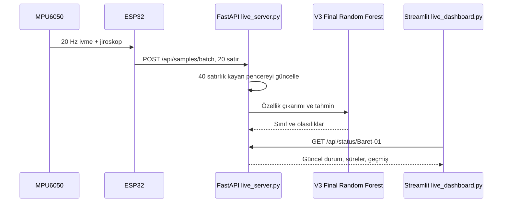

# Sistem Mimarisi

Bu doküman, canlı Akıllı Baret prototipinin veri akışını, API yüzeyini ve tahmin mantığını açıklar.

## Veri Akışı



Canlı kullanımda ESP32, MPU6050 sensöründen yaklaşık 20 Hz veri okur. Her 20 satırlık paket yaklaşık 1 saniyelik yeni veri anlamına gelir ve `/api/samples/batch` endpointine gönderilir.

## Tahmin Penceresi

V3 final model dosyasında kayıtlı değerler kullanılır:

| Parametre | Değer | Anlam |
| --- | ---: | --- |
| `window_size` | 40 satır | Yaklaşık 2 saniyelik sensör penceresi |
| `step_size` | 20 satır | Yaklaşık 1 saniyelik güncelleme |
| Örnekleme | 20 Hz | ESP32 tarafında 50 ms aralık |

Sunucu, her baret için son 40 sensör satırını bellekte tutar. İlk tahmin için 40 satır gerekir. Sonrasında her 20 satırlık paket yeni bir tahmin denemesi üretir.

## Özellik Çıkarımı

Sunucu aşağıdaki sensör kanallarından istatistiksel özellikler çıkarır:

```text
acc_x, acc_y, acc_z, gyro_x, gyro_y, gyro_z, acc_mag, gyro_mag
```

Her kanal için ortalama, standart sapma, minimum, maksimum, aralık ve RMS hesaplanır. Toplam 48 feature, modelin eğitimde gördüğü kolon sırası ile modele verilir.

## Canlı Durum Kararlılığı

`live_server.py`, tek pencerelik sıçramaların panelde ani durum değişimi üretmesini azaltmak için basit bir kararlılık filtresi uygular. Yeni bir sınıfa geçmek için aynı yeni sınıfın 2 ardışık tahminde gelmesi gerekir.

Bu filtre modelin kendisini değiştirmez; yalnızca canlı panelde görünen sabit durumun daha sakin güncellenmesini sağlar.

## API Endpointleri

| Endpoint | Metot | Açıklama |
| --- | --- | --- |
| `/health` | GET | Sunucu, model yolu, pencere ve adım bilgisi |
| `/api/helmets` | GET | Bellekteki tüm baret durumları |
| `/api/status/{helmet_id}` | GET | Seçili baretin güncel durumu, süreleri ve grafik geçmişi |
| `/api/reset/{helmet_id}` | POST | Seçili baretin canlı belleğini sıfırlar |
| `/api/samples/batch` | POST | ESP32 veya simülasyon tarafından 20 satırlık sensör paketi gönderilir |

`/api/samples/batch` cevabı ESP32 için kısa tutulur. Büyük geçmiş verisi bu cevapta döndürülmez; dashboard geçmişi `/api/status/{helmet_id}` endpointinden alır.

## Paket JSON Yapısı

```json
{
  "helmet_id": "Baret-01",
  "samples": [
    {
      "time_ms": 12345,
      "acc_x": 0.0,
      "acc_y": 0.0,
      "acc_z": 9.8,
      "gyro_x": 0.0,
      "gyro_y": 0.0,
      "gyro_z": 0.0,
      "temp_c": 28.5
    }
  ]
}
```

Her pakette `step_size` kadar, yani mevcut final model için 20 sensör satırı bulunmalıdır.
